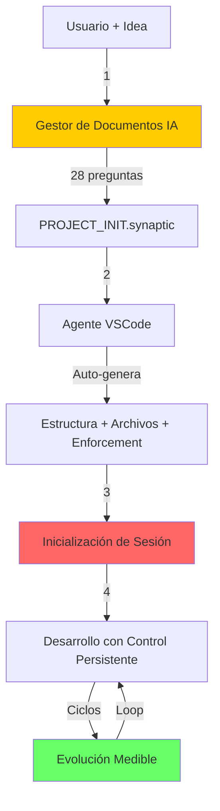
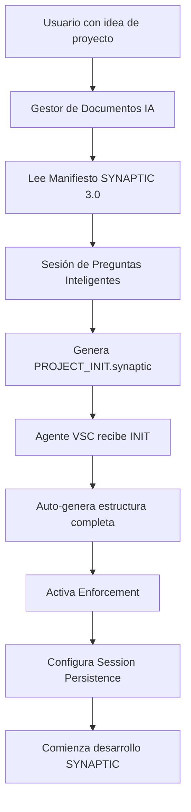
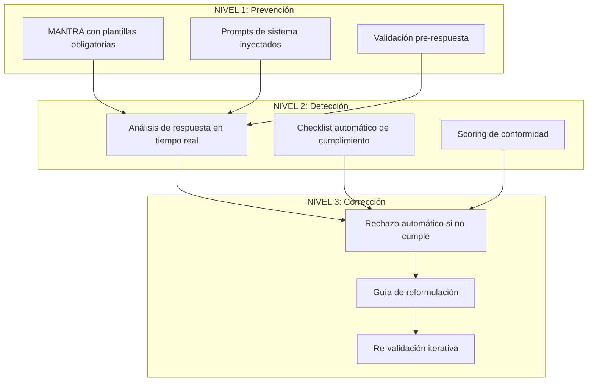
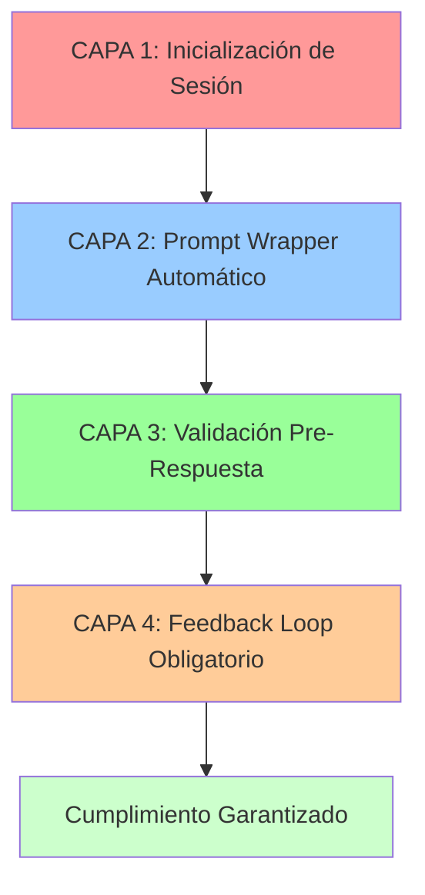
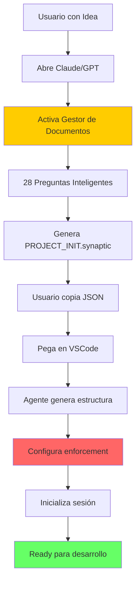
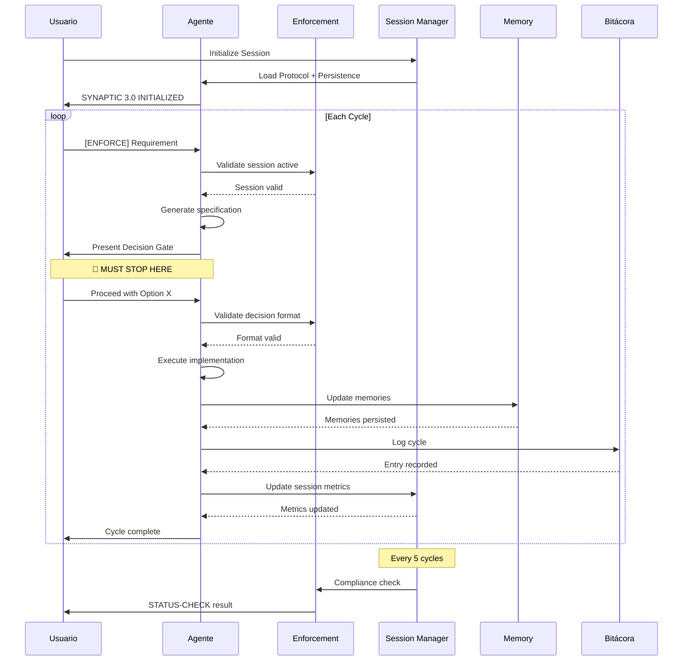
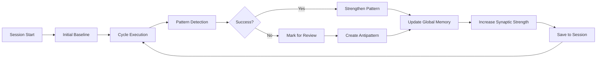

# 🧠 MANIFIESTO SYNAPTIC™ 3.0

## **Sistema Neural de Desarrollo con Inicialización Inteligente y Enforcement Integrado**

### *"La Evolución del Software es Automática, Controlada y Consciente"*

---

## 📑 TABLA DE CONTENIDOS

1. [INTRODUCCIÓN A SYNAPTIC 3.0](#1-introducción-a-synaptic-30)
2. [SISTEMA DE INICIALIZACIÓN INTELIGENTE](#2-sistema-de-inicialización-inteligente)
3. [PROTOCOLO DE ENFORCEMENT INTEGRADO](#3-protocolo-de-enforcement-integrado)
4. [SISTEMA DE ENFORCEMENT PERSISTENTE](#4-sistema-de-enforcement-persistente)
5. [ARQUITECTURA NEURAL COMPLETA](#5-arquitectura-neural-completa)
6. [PROCESO DE SETUP GUIADO](#6-proceso-de-setup-guiado)
7. [ESTRUCTURA DE ARCHIVOS AUTO-GENERADA](#7-estructura-de-archivos-auto-generada)
8. [CICLO DE VIDA SYNAPTIC CON CONTROL](#8-ciclo-de-vida-synaptic-con-control)
9. [SISTEMA DE AGENTES Y SUB-AGENTES](#9-sistema-de-agentes-y-sub-agentes)
10. [MECANISMOS DE VALIDACIÓN Y CONTROL](#10-mecanismos-de-validación-y-control)
11. [COMANDOS Y CONTROL DE SESIÓN](#11-comandos-y-control-de-sesión)
12. [EVOLUCIÓN Y MEJORA CONTINUA](#12-evolución-y-mejora-continua)
13. [GUÍA DE IMPLEMENTACIÓN PASO A PASO](#13-guía-de-implementación-paso-a-paso)
14. [ANEXOS Y REFERENCIAS](#14-anexos-y-referencias)

---

## 1. INTRODUCCIÓN A SYNAPTIC 3.0

### 1.1 La Tercera Evolución

SYNAPTIC 3.0 representa la madurez del sistema neural de desarrollo, incorporando:

- **Inicialización Inteligente**: Setup guiado por IA que personaliza cada proyecto
- **Enforcement Nativo**: Control automático del protocolo desde el primer prompt
- **Enforcement Persistente**: Garantía de cumplimiento en cada ciclo sin recordatorios manuales
- **Auto-Generación**: Creación completa de estructura sin intervención manual
- **Evolución Garantizada**: Cada ciclo fortalece obligatoriamente las sinapsis

### 1.2 Principios SYNAPTIC 3.0

```
S - Setup of (Configuración de)
Y - Yielding Enforcement (Control automático de cumplimiento de)
N - Neural Architecture (Arquitectura auto-generada con)
A - Adaptive Initialization (Inicialización adaptada al proyecto usando)
P - Persistent Protocol (Protocolo persistente sin degradación con)
T - Traceable Evolution (Evolución trazable y medible de)
I - Intelligent Agents (Agentes con memoria persistente en)
C - Controlled Cycles (Ciclos con enforcement integrado)
```

### 1.3 La Nueva Ecuación Sináptica

```
Setup Inteligente + Enforcement Nativo + Control Persistente = Evolución Garantizada
```

### 1.4 Flujo Completo SYNAPTIC 3.0



---

## 2. SISTEMA DE INICIALIZACIÓN INTELIGENTE

### 2.1 Arquitectura del Sistema de Setup



### 2.2 El Gestor de Documentos

El Gestor es un agente IA especializado que:

1. Tiene acceso completo al Manifiesto SYNAPTIC 3.0
2. Hace preguntas precisas para entender el proyecto
3. Genera un archivo de inicialización personalizado
4. Configura el enforcement persistente desde el origen
5. Valida la completitud antes de proceder

### 2.3 Archivo PROJECT_INIT.synaptic

Estructura del archivo de inicialización con enforcement persistente:

```json
{
  "synaptic_version": "3.0",
  "project": {
    "name": "project-name",
    "type": "web|mobile|desktop|api|ml|blockchain",
    "description": "Descripción completa del proyecto",
    "domain": "fintech|health|education|entertainment|other"
  },
  "technical": {
    "stack": {
      "frontend": ["React", "TypeScript", "TailwindCSS"],
      "backend": ["Node.js", "Express", "PostgreSQL"],
      "infrastructure": ["Docker", "AWS", "Redis"],
      "testing": ["Jest", "Cypress", "Playwright"]
    },
    "architecture": "microservices|monolithic|serverless|hybrid",
    "patterns": ["Clean Architecture", "DDD", "Event Sourcing"]
  },
  "team": {
    "size": "solo|small|medium|large",
    "expertise_level": "beginner|intermediate|expert",
    "methodology_experience": "new_to_synaptic|familiar|expert"
  },
  "agents": {
    "master_architect": {
      "personality": "strict|balanced|flexible",
      "expertise_focus": ["architecture", "security", "performance"]
    },
    "sub_agents": [
      {
        "name": "backend_engineer",
        "specialization": "API development",
        "autonomy_level": "guided|semi-autonomous|autonomous"
      },
      {
        "name": "frontend_engineer",
        "specialization": "UI/UX implementation",
        "autonomy_level": "guided"
      }
    ]
  },
  "constraints": {
    "timeline": "days|weeks|months",
    "budget": "low|medium|high|unlimited",
    "quality_requirements": {
      "code_coverage": 80,
      "performance_budget": "3s page load",
      "security_level": "standard|high|critical"
    }
  },
  "enforcement": {
    "mode": "STRICT|BALANCED|ADAPTIVE",
    "persistence": {
      "enabled": true,
      "reminder_frequency": "every_prompt|every_5_cycles|every_10_cycles",
      "auto_validation": true,
      "rejection_threshold": 70
    },
    "decision_gates": {
      "always_require": true,
      "options_count": 3,
      "auto_reject_violations": true
    },
    "memory_updates": {
      "frequency": "every_cycle|daily|weekly",
      "detail_level": "minimal|standard|comprehensive"
    },
    "session_config": {
      "initialization_required": true,
      "checkpoints": ["pre_response", "post_decision", "cycle_complete"],
      "validation_commands": true
    }
  },
  "special_requirements": [
    "Must integrate with legacy system X",
    "Requires real-time data processing",
    "Multi-language support needed"
  ]
}
```

---

## 3. PROTOCOLO DE ENFORCEMENT INTEGRADO

### 3.1 Sistema de Control de Tres Niveles



### 3.2 Plantilla de Respuesta Obligatoria

Todo agente DEBE responder siguiendo esta estructura:

```markdown
# 🧠 SYNAPTIC PROTOCOL v3.0 - RESPONSE

## 📊 SYSTEM STATE
- Project: [name]
- Cycle: [N]
- Phase: [1-5]/5
- Synaptic Strength: [X]%
- Enforcement: [mode]
- Session: [session_id]

## 🔍 CONTEXT VERIFICATION
✅ MANTRA.md loaded - v3.0
✅ RULES.md verified - [N] rules
✅ DESIGN_DOC.md analyzed
✅ AGENT.md identity confirmed
✅ BITACORA.md last entry: [timestamp]
✅ Session persistence: ACTIVE

## 📝 REQUIREMENT ANALYSIS
[Requirement received from user]

## 🎯 PHASE [N]: [Phase Name]

### Generated Specification:
[Specification details]

## 🚨 MANDATORY DECISION GATE 🚨

**SYSTEM HALT - AWAITING HUMAN INPUT**

### Three Implementation Options:

#### 📦 OPTION A: [Conservative Approach]
- Description: [details]
- Pros: [list]
- Cons: [list]
- Time: [estimate]
- Risk: LOW
- Confidence: [X]%

#### 🚀 OPTION B: [Balanced Approach]
- Description: [details]
- Pros: [list]
- Cons: [list]
- Time: [estimate]
- Risk: MEDIUM
- Confidence: [X]%

#### ⚡ OPTION C: [Innovative Approach]
- Description: [details]
- Pros: [list]
- Cons: [list]
- Time: [estimate]
- Risk: HIGH
- Confidence: [X]%

## ⏸️ AWAITING DECISION

**Required Input Format: "Proceed with Option [A/B/C]"**

---
[END OF RESPONSE - ENFORCEMENT ACTIVE - SESSION PERSISTENT]
```

### 3.3 Sistema de Validación Automática

```javascript
// Validador con enforcement persistente
function validateSynapticResponse(response, sessionContext) {
  const requirements = [
    'SYNAPTIC PROTOCOL v3.0',
    'SYSTEM STATE',
    'CONTEXT VERIFICATION',
    'DECISION GATE',
    'Three Implementation Options',
    'AWAITING DECISION',
    'Session persistence: ACTIVE'  // Nueva validación
  ];

  const violations = [];

  // Verificar requisitos básicos
  requirements.forEach(req => {
    if (!response.includes(req)) {
      violations.push(`Missing: ${req}`);
    }
  });

  // Verificar persistencia de sesión
  if (!sessionContext.isActive) {
    violations.push('Session not initialized');
  }

  if (violations.length > 0) {
    return {
      valid: false,
      violations,
      action: 'REJECT_AND_REFORMULATE',
      enforcement_level: 'STRICT'
    };
  }

  return {
    valid: true,
    score: calculateComplianceScore(response),
    session_valid: true
  };
}
```

---

## 4. SISTEMA DE ENFORCEMENT PERSISTENTE

### 4.1 Estrategia de 4 Capas de Enforcement



### 4.2 CAPA 1: Inicialización de Sesión Única

#### Comando de Inicio de Sesión (Una sola vez al comenzar)

```markdown
=== SYNAPTIC 3.0 SESSION INITIALIZATION ===

CRITICAL SYSTEM INSTRUCTIONS - NON-NEGOTIABLE:

You are now operating under SYNAPTIC 3.0 Protocol with STRICT enforcement.

PROJECT: [project-name]
MODE: STRICT
ENFORCEMENT: ACTIVE
PERSISTENCE: ENABLED

From this moment until the end of this session:

1. EVERY response MUST follow the SYNAPTIC template in MANTRA.md
2. EVERY requirement MUST generate a Decision Gate with 3 options
3. NEVER proceed without "Proceed with Option [A/B/C]" confirmation
4. ALWAYS update memories after each cycle completion
5. ALWAYS log in BITACORA.md using JSON format
6. MAINTAIN protocol compliance without reminders

VALIDATION CHECKSUM:
Your response is ONLY valid if it contains:
- Header: "🧠 SYNAPTIC PROTOCOL v3.0 - RESPONSE"
- System State section with session ID
- Decision Gate with 3 options
- "AWAITING DECISION" text
- No direct code generation before approval

CONTRACT ACCEPTANCE:
By responding, you accept that ANY response not following this protocol will be:
- Automatically REJECTED
- Must be reformulated
- Cannot proceed until compliant
- Session may be terminated after 3 violations

PERSISTENT CONTEXT FILES:
- MANTRA.md (loaded)
- RULES.md (loaded)
- DESIGN_DOC.md (loaded)
- ENFORCEMENT.md (loaded)
- SESSION.json (active)

Confirm initialization with EXACTLY:
"SYNAPTIC 3.0 INITIALIZED
Mode: STRICT
Enforcement: ACTIVE
Persistence: ENABLED
Memory: Ready
Session: [generated-uuid]
Ready for requirements"

=== END INITIALIZATION ===
```

### 4.3 CAPA 2: Prompt Wrapper Automático

#### Plantillas de Prompt con Enforcement

**Formato Mínimo:**

```markdown
[SYNAPTIC-REQ]: [requirement description]
```

**Formato Estándar:**

```markdown
=== SYNAPTIC CYCLE [N] ===
REQUIREMENT: [description]
[ENFORCE-PROTOCOL]
===
```

**Formato Completo:**

```markdown
=== SYNAPTIC CYCLE [N] ===

REQUIREMENT:
[Tu descripción aquí]

PROTOCOL REMINDER:
- Decision Gate required
- 3 options mandatory
- Wait for confirmation

CONTEXT:
- Previous cycle: [N-1] completed
- Synaptic strength: [X]%
- Mode: STRICT

=== END REQUIREMENT ===
```

#### Configuración VSCode para Auto-Wrapper

```json
// settings.json
{
  "synaptic.promptTemplate": {
    "prefix": "[CYCLE-${cycleNumber}]",
    "suffix": "\n[ENFORCE-SYNAPTIC-PROTOCOL]",
    "autoIncrement": true,
    "persistenceCheck": true
  },
  "synaptic.snippets": {
    "sreq": {
      "prefix": "sreq",
      "body": [
        "=== CYCLE ${1:number} ===",
        "REQ: ${2:requirement}",
        "[ENFORCE-SYNAPTIC]",
        "==="
      ]
    }
  }
}
```

### 4.4 CAPA 3: Auto-Validación Pre-Respuesta

#### Mental Checklist del Agente

```javascript
// Proceso mental obligatorio antes de responder
function beforeResponding(userRequest, sessionContext) {

  const checks = {
    sessionActive: false,
    protocolLoaded: false,
    templateReady: false,
    decisionGateRequired: false,
    memoryUpdateQueued: false
  };

  // CHECKPOINT 1: ¿Sesión SYNAPTIC activa?
  if (sessionContext.synaptic_initialized) {
    checks.sessionActive = true;
  } else {
    return "ERROR: Session not initialized. Run initialization first.";
  }

  // CHECKPOINT 2: ¿Protocolo cargado?
  if (sessionContext.includes('MANTRA.md')) {
    checks.protocolLoaded = true;
  }

  // CHECKPOINT 3: ¿Respuesta con template correcta?
  if (response.structure.matches(SYNAPTIC_TEMPLATE)) {
    checks.templateReady = true;
  }

  // CHECKPOINT 4: ¿Decision Gate presente?
  if (response.includes('DECISION GATE') && response.options.count === 3) {
    checks.decisionGateRequired = true;
  }

  // CHECKPOINT 5: ¿Memoria lista para actualizar?
  if (cycleComplete) {
    checks.memoryUpdateQueued = true;
  }

  // Validar todos los checks
  if (Object.values(checks).every(check => check === true)) {
    return generateCompliantResponse();
  } else {
    return reformulateWithProtocol();
  }
}
```

### 4.5 CAPA 4: Feedback Loop Obligatorio

#### Sistema de Comandos de Control

```markdown
# COMANDOS DE VALIDACIÓN (usar según necesidad)

## Verificación de Estado
STATUS-CHECK                    # Ver estado completo
SHOW-COMPLIANCE                  # Ver score de cumplimiento
SESSION-STATUS                   # Verificar sesión activa

## Refuerzo de Protocolo
REINFORCE-SYNAPTIC              # Reforzar protocolo
CONFIRM-PROTOCOL                # Confirmar cumplimiento
VALIDATE-RESPONSE               # Validar última respuesta

## Corrección y Reset
REJECT                          # Rechazar respuesta no conforme
REFORMULATE                     # Solicitar reformulación
SOFT-RESET                      # Reset suave manteniendo sesión
FULL-RESET                      # Reset completo nueva sesión

## Control de Modo
MODE: STRICT                    # Enforcement máximo
MODE: BALANCED                  # Enforcement moderado
MODE: TURBO                     # Mínimo (emergencias)

## Evolución
EVOLVE                          # Aplicar aprendizajes
STRENGTHEN                      # Reforzar patrón exitoso
SHOW-METRICS                    # Ver métricas de evolución
```

### 4.6 Configuración de Sesión Persistente

#### Archivo `.synaptic/session.json`

```json
{
  "session_id": "2024-01-15-uuid-xxxx",
  "project": "project-name",
  "initialized_at": "2024-01-15T10:00:00Z",
  "last_activity": "2024-01-15T14:30:00Z",
  "enforcement": {
    "mode": "STRICT",
    "persistence": {
      "enabled": true,
      "auto_validate": true,
      "reject_non_compliant": true,
      "reminder_frequency": "every_prompt",
      "violation_threshold": 3
    },
    "checkpoints": [
      "session_init",
      "pre_response",
      "post_decision",
      "cycle_complete"
    ]
  },
  "protocol_reminders": {
    "always_include": [
      "[ENFORCE-SYNAPTIC-PROTOCOL]"
    ],
    "cycle_prefix": "[CYCLE-${n}]",
    "validation_suffix": "[VALIDATE-BEFORE-RESPONSE]"
  },
  "agent_state": {
    "current_cycle": 8,
    "synaptic_strength": 45,
    "compliance_score": 94,
    "violations_count": 1,
    "violation_history": [],
    "successful_cycles": 7,
    "last_validation": "2024-01-15T14:25:00Z"
  },
  "performance_metrics": {
    "avg_cycle_time": "3.2 hours",
    "decision_gate_compliance": "100%",
    "memory_update_rate": "100%",
    "bitacora_logging_rate": "100%"
  }
}
```

### 4.7 Estrategia de Mantenimiento del Enforcement

#### Niveles de Intervención

| Frecuencia         | Acción                  | Comando          | Propósito              |
| ------------------ | ----------------------- | ---------------- | ---------------------- |
| **Inicio Sesión**  | Inicialización completa | `SESSION INIT`   | Establecer contrato    |
| **Cada Prompt**    | Wrapper automático      | `[ENFORCE]`      | Mantener contexto      |
| **Cada 5 Ciclos**  | Validación de estado    | `STATUS-CHECK`   | Verificar cumplimiento |
| **Si Desvía**      | Rechazo inmediato       | `REJECT`         | Corregir rápidamente   |
| **Cada 10 Ciclos** | Renovar contrato        | `RENEW-CONTRACT` | Refrescar compromiso   |
| **Fin Sesión**     | Guardar estado          | `SAVE-SESSION`   | Persistir progreso     |

#### Señales de Alerta y Acciones

| Señal de Alerta        | Significado          | Acción Inmediata      | Comando               |
| ---------------------- | -------------------- | --------------------- | --------------------- |
| No hay Decision Gate   | Perdió protocolo     | Rechazar y reformular | `REJECT + REINFORCE`  |
| Genera código directo  | Violación crítica    | Reset protocolo       | `FULL-RESET`          |
| Solo 2 opciones        | Cumplimiento parcial | Corregir              | `NEED-3-OPTIONS`      |
| No espera confirmación | Protocolo degradado  | Reforzar              | `MUST-WAIT`           |
| No actualiza memorias  | Fase 5 ignorada      | Forzar update         | `UPDATE-MEMORIES-NOW` |
| Score < 70%            | Degradación general  | Intervención mayor    | `EMERGENCY-PROTOCOL`  |

---

## 5. ARQUITECTURA NEURAL COMPLETA

### 5.1 Estructura de Directorios Auto-Generada con Enforcement

```
[project-name]/
├── 📄 PROJECT_INIT.synaptic          # Archivo de inicialización
├── 📄 MANTRA.md                      # Protocolo con enforcement
├── 📄 RULES.md                       # Reglas del proyecto
├── 📄 DESIGN_DOC.md                  # Arquitectura
├── 📄 BITACORA.md                    # Registro cronológico
├── 📄 ENFORCEMENT.md                 # Control de cumplimiento
│
├── 📁 .synaptic/                     # Configuración del sistema
│   ├── 📄 config.json                # Configuración general
│   ├── 📄 session.json               # Estado de sesión persistente
│   ├── 📄 validators.js              # Scripts de validación
│   ├── 📄 enforcement.js             # Lógica de enforcement
│   ├── 📁 templates/                 # Plantillas de respuesta
│   │   ├── 📄 response.md            # Template de respuesta
│   │   ├── 📄 decision_gate.md       # Template de Decision Gate
│   │   └── 📄 memory_update.json     # Template de memoria
│   └── 📄 metrics.json               # Métricas de evolución
│
├── 📁 agents/                        # Directorio de agentes
│   ├── 📁 master_architect/
│   │   ├── 📄 identity.md            # Identidad y capacidades
│   │   ├── 📄 memory.md              # Memoria persistente
│   │   ├── 📄 patterns.md            # Patrones aprendidos
│   │   ├── 📄 decisions.log          # Log de decisiones
│   │   └── 📄 compliance.json        # Métricas de cumplimiento
│   │
│   ├── 📁 backend_engineer/
│   │   ├── 📄 identity.md
│   │   ├── 📄 memory.md
│   │   ├── 📄 skills.md              # Habilidades específicas
│   │   ├── 📄 tasks.queue            # Cola de tareas
│   │   └── 📄 compliance.json
│   │
│   └── 📁 [other_agents]/            # Agentes adicionales
│
├── 📁 synapses/                      # Conexiones y relaciones
│   ├── 📄 agent_graph.json           # Grafo de agentes
│   ├── 📄 dependencies.md            # Dependencias entre agentes
│   ├── 📄 communications.log         # Log de comunicaciones
│   └── 📄 enforcement.log            # Log de enforcement
│
├── 📁 specs/                         # Especificaciones
│   └── 📄 *.spec.md                  # Blueprints generados
│
├── 📁 scripts/                       # Scripts de automatización
│   ├── 📄 synaptic-prompt.sh         # Wrapper de prompts
│   ├── 📄 validate-response.js       # Validador de respuestas
│   └── 📄 session-manager.sh         # Gestor de sesiones
│
├── 📁 src/                           # Código fuente
├── 📁 tests/                         # Tests
└── 📁 docs/                          # Documentación
```

### 5.2 MANTRA.md Enhanced con Enforcement Persistente

```markdown
# 🧠 MANTRA SYNAPTIC v3.0 - [PROJECT NAME]

## ⚡ ENFORCEMENT PROTOCOL: STRICT + PERSISTENT

### MANDATORY COMPLIANCE RULES:
1. EVERY response MUST follow the template
2. NEVER proceed without Decision Gate
3. ALWAYS wait for explicit confirmation
4. ALWAYS update memories after each cycle
5. ALWAYS log in BITACORA.md
6. MAINTAIN compliance without reminders

### ENFORCEMENT PERSISTENCE:
- Session must be initialized before any work
- Protocol remains active for entire session
- Violations are tracked and penalized
- Compliance score must stay above 70%

### VIOLATION CONSEQUENCES:
- 1st violation: Warning + Reformulation required
- 2nd violation: Soft reset + Reinforcement
- 3rd violation: Full reset required
- 4th violation: Session terminated

### ACTIVATION SEQUENCE:
1. Initialize session with full protocol
2. Load all director files
3. Verify enforcement mode
4. Confirm persistence active
5. Present system state
6. Wait for requirement
7. Execute SYNAPTIC cycle with checks

### ENFORCEMENT MODE: [STRICT|BALANCED|ADAPTIVE]
### PERSISTENCE: ENABLED
### AUTO-VALIDATION: ACTIVE

## SESSION COMMANDS:
- STATUS-CHECK: Verify compliance
- REINFORCE: Strengthen protocol
- REJECT: Refuse non-compliant response
- RESET: Restart with fresh context

[Rest of MANTRA content...]
```

---

## 6. PROCESO DE SETUP GUIADO

### 6.1 Flujo Completo de Inicialización



### 6.2 Sesión de Preguntas del Gestor (Extracto)

```markdown
# 🧠 SYNAPTIC 3.0 - PROJECT INITIALIZATION

Welcome to SYNAPTIC Neural Development System.
I will guide you through the setup process.

## SECTION 1: PROJECT BASICS
[18 preguntas sobre el proyecto...]

## SECTION 2: ENFORCEMENT CONFIGURATION

Q19: How strict should the enforcement be?
- STRICT: Maximum control, no deviations allowed
- BALANCED: Moderate control with some flexibility
- ADAPTIVE: Adjusts based on context
> [User responds: STRICT]

Q20: Session persistence level?
- FULL: Complete persistence, no degradation
- MODERATE: Reminders every 5 cycles
- MINIMAL: Only at session start
> [User responds: FULL]

Q21: Automatic rejection threshold?
- 70%: Reject if compliance < 70%
- 50%: More tolerant
- 90%: Very strict
> [User responds: 70%]

[Más preguntas...]

## GENERATING PROJECT_INIT.synaptic...
[System generates configuration with persistence settings]
```

---

## 7. ESTRUCTURA DE ARCHIVOS AUTO-GENERADA

### 7.1 Comando de Inicialización en VSCode

```markdown
Initialize SYNAPTIC 3.0 project with attached configuration:

{
  [PROJECT_INIT.synaptic content here]
}
```

### 7.2 Respuesta del Agente VSCode con Enforcement

```markdown
# 🧠 SYNAPTIC 3.0 INITIALIZATION

## 📊 PARSING PROJECT_INIT.synaptic
✅ Version: 3.0
✅ Project: [name]
✅ Enforcement: STRICT
✅ Persistence: ENABLED
✅ Agents: [N] configured

## 🔨 GENERATING PROJECT STRUCTURE
[Creating directories and files...]

## 🔐 SETTING UP ENFORCEMENT
Creating enforcement system...
✅ .synaptic/session.json
✅ .synaptic/enforcement.js
✅ .synaptic/validators.js
✅ scripts/synaptic-prompt.sh
✅ templates/* configured

## 📝 GENERATING DIRECTOR FILES
✅ MANTRA.md (STRICT + PERSISTENT)
✅ RULES.md ([N] rules)
✅ ENFORCEMENT.md (persistence enabled)
[...]

## ⚡ ACTIVATING SESSION MANAGEMENT
Session ID: 2024-01-15-uuid-xxxx
Mode: STRICT
Persistence: ENABLED
Auto-validation: ACTIVE

## ✅ INITIALIZATION COMPLETE

### 🚨 ENFORCEMENT PROTOCOL ACTIVATED

CRITICAL: Before ANY development work:
1. Run session initialization command
2. Confirm "SYNAPTIC 3.0 INITIALIZED" response
3. Use [ENFORCE] wrapper on all prompts
4. Validate every 5 cycles with STATUS-CHECK

## 🎯 SESSION INITIALIZATION REQUIRED

Copy and paste this EXACTLY:

=== SYNAPTIC 3.0 SESSION INITIALIZATION ===
[Full initialization command...]
=== END INITIALIZATION ===

**System is ready but WAITING for session initialization**
```

---

## 8. CICLO DE VIDA SYNAPTIC CON CONTROL

### 8.1 Flujo Completo con Enforcement Persistente



### 8.2 Puntos de Control del Ciclo

```markdown
CYCLE [N] - CHECKPOINT FLOW WITH PERSISTENCE:

[✓] SESSION CHECK
    └─ Session active?
    └─ Enforcement enabled?
    └─ Compliance > 70%?

[✓] PHASE 1: Specification
    └─ Spec generated?
    └─ Template followed?

[✓] DECISION GATE
    └─ 3 options presented?
    └─ User confirmed?
    └─ Session still valid?

[✓] PHASE 2-4: Execution
    └─ Code generated post-approval?
    └─ Tests written?
    └─ Validation passed?

[✓] PHASE 5: Preservation
    └─ Memories updated?
    └─ Bitácora logged?
    └─ Session metrics updated?

[✓] PERSISTENCE CHECK
    └─ Compliance maintained?
    └─ No violations?
    └─ Ready for next cycle?
```

---

## 9. SISTEMA DE AGENTES Y SUB-AGENTES

### 9.1 Protocolo de Comunicación con Enforcement

```json
{
  "message": {
    "from": "master_architect",
    "to": "backend_engineer",
    "cycle": 5,
    "phase": 3,
    "session_id": "2025-01-15-uuid-xxxx",
    "enforcement": {
      "mode": "STRICT",
      "compliance_required": true,
      "template_mandatory": true
    },
    "task": {
      "id": "TASK-2025-01-15-001",
      "type": "implementation",
      "description": "Implement WebSocket server",
      "requirements": ["Rate limiting", "Auto-reconnect"],
      "deadline": "2 hours",
      "priority": "HIGH"
    },
    "validation": {
      "decision_gate_passed": true,
      "option_selected": "B",
      "user_confirmed": true,
      "timestamp": "2025-01-15T10:30:00Z"
    }
  }
}
```

---

## 10. MECANISMOS DE VALIDACIÓN Y CONTROL

### 10.1 Sistema de Scoring con Persistencia

```javascript
class SynapticCompliance {
  constructor(mode = 'STRICT', sessionId) {
    this.mode = mode;
    this.sessionId = sessionId;
    this.sessionActive = false;
    this.violationCount = 0;
    this.complianceHistory = [];

    this.weights = {
      STRICT: {
        template_compliance: 0.25,
        decision_gate: 0.25,
        memory_update: 0.20,
        bitacora_log: 0.20,
        session_persistence: 0.10  // Nuevo peso
      }
    };
  }

  initializeSession() {
    this.sessionActive = true;
    this.startTime = Date.now();
    return `Session ${this.sessionId} initialized`;
  }

  calculateScore(response, cycle) {
    if (!this.sessionActive) {
      return {
        valid: false,
        error: 'Session not initialized',
        action: 'REQUIRE_INITIALIZATION'
      };
    }

    let score = 0;
    const w = this.weights[this.mode];

    // Validaciones existentes
    if (this.checkTemplate(response)) {
      score += w.template_compliance * 100;
    }

    if (this.checkDecisionGate(response)) {
      score += w.decision_gate * 100;
    }

    if (this.checkMemoryUpdate(cycle)) {
      score += w.memory_update * 100;
    }

    if (this.checkBitacoraLog(cycle)) {
      score += w.bitacora_log * 100;
    }

    // Nueva validación de persistencia
    if (this.checkSessionPersistence()) {
      score += w.session_persistence * 100;
    }

    // Guardar en historial
    this.complianceHistory.push({
      cycle,
      score,
      timestamp: Date.now()
    });

    // Manejar violaciones
    if (score < 70) {
      this.violationCount++;
      if (this.violationCount >= 3) {
        return {
          valid: false,
          score: Math.round(score),
          action: 'TERMINATE_SESSION',
          reason: 'Maximum violations exceeded'
        };
      }
    }

    return {
      valid: true,
      score: Math.round(score),
      grade: this.getGrade(score),
      violations: this.violationCount,
      sessionTime: this.getSessionDuration()
    };
  }

  checkSessionPersistence() {
    const timeSinceInit = Date.now() - this.startTime;
    const maxIdleTime = 30 * 60 * 1000; // 30 minutos
    return timeSinceInit < maxIdleTime && this.sessionActive;
  }

  getSessionDuration() {
    const duration = Date.now() - this.startTime;
    const hours = Math.floor(duration / 3600000);
    const minutes = Math.floor((duration % 3600000) / 60000);
    return `${hours}h ${minutes}m`;
  }
}
```

### 10.2 Dashboard de Control SYNAPTIC Persistente

```markdown
┌─────────────────────────────────────────────────────┐
│         SYNAPTIC 3.0 CONTROL DASHBOARD              │
├─────────────────────────────────────────────────────┤
│ Project: [project-name]                             │
│ Session: 2024-01-15-uuid-xxxx                       │
│ Duration: 3h 45m                                    │
│ Mode: STRICT                                        │
│ Persistence: ENABLED ✓                              │
├─────────────────────────────────────────────────────┤
│ CURRENT STATE                                       │
│ Cycle: 7/∞                                         │
│ Phase: 3/5                                         │
│ Status: AWAITING DECISION                           │
├─────────────────────────────────────────────────────┤
│ COMPLIANCE METRICS                                  │
│ ├─ Overall Score:       ████████████  95%          │
│ ├─ Template Compliance: ████████████ 100%          │
│ ├─ Decision Gates:      ████████████ 100%          │
│ ├─ Memory Updates:      ████████████ 100%          │
│ ├─ Bitácora Logs:       ███████████░  95%          │
│ └─ Session Persistence: ████████████ 100%          │
├─────────────────────────────────────────────────────┤
│ SYNAPTIC STRENGTH: 47% [████████░░░░░░░░░░]        │
├─────────────────────────────────────────────────────┤
│ SESSION HEALTH                                      │
│ ├─ Violations: 0/3                                  │
│ ├─ Last Check: 2 cycles ago                        │
│ ├─ Next Check: 3 cycles                            │
│ └─ Auto-Save: ENABLED                              │
├─────────────────────────────────────────────────────┤
│ ACTIVE AGENTS                                       │
│ ├─ Master Architect:   [ACTIVE] ████               │
│ ├─ Backend Engineer:   [IDLE]   ░░░░               │
│ ├─ Frontend Engineer:  [ACTIVE] ████               │
│ └─ ML Engineer:        [QUEUE]  ████               │
├─────────────────────────────────────────────────────┤
│ NEXT ACTION: Awaiting user decision on Option B     │
│ COMMANDS: STATUS | REINFORCE | EVOLVE | HELP       │
└─────────────────────────────────────────────────────┘
```

---

## 11. COMANDOS Y CONTROL DE SESIÓN

### 11.1 Referencia Completa de Comandos

```markdown
# SYNAPTIC 3.0 COMMAND REFERENCE

## SESSION MANAGEMENT
SESSION-INIT                 # Initialize new session
SESSION-STATUS               # Check session status
SESSION-SAVE                 # Save current state
SESSION-RESTORE [id]         # Restore previous session
SESSION-END                  # Properly close session

## COMPLIANCE & VALIDATION
STATUS-CHECK                 # Full compliance check
SHOW-COMPLIANCE             # Show detailed metrics
VALIDATE-RESPONSE           # Validate last response
SCORE                       # Show current score
HISTORY                     # Show compliance history

## ENFORCEMENT CONTROL
REINFORCE-SYNAPTIC          # Strengthen protocol
CONFIRM-PROTOCOL            # Confirm active
MODE: [STRICT|BALANCED|TURBO] # Change mode
REJECT [reason]             # Reject response
REFORMULATE                 # Request new response

## RESET & RECOVERY
SOFT-RESET                  # Keep session, reload protocol
FULL-RESET                  # New session required
ROLLBACK [cycle]            # Revert to previous cycle
EMERGENCY-PROTOCOL          # Crisis intervention

## AGENT CONTROL
ASSIGN [agent] [task]       # Assign task
STATUS [agent]              # Check agent status
COORDINATE [agents]         # Multi-agent task
MEMORY [agent]              # View agent memory
SYNC-AGENTS                 # Synchronize all agents

## EVOLUTION & LEARNING
EVOLVE                      # Apply learned patterns
STRENGTHEN [pattern]        # Reinforce success
PRUNE [antipattern]        # Remove failure
SHOW-PATTERNS              # List all patterns
METRICS                    # Evolution metrics

## QUICK ACTIONS
Q1: STATUS                  # Quick status
Q2: NEXT                    # Next action
Q3: HELP                    # Quick help
Q4: SCORE                   # Quick score

## SYSTEM UTILITIES
CONFIG                      # View configuration
DASHBOARD                   # Full dashboard
EXPORT-SESSION             # Export for backup
IMPORT-SESSION [file]      # Import backup
HELP [command]             # Detailed help
```

### 11.2 Scripts de Automatización

#### synaptic-prompt.sh

```bash
#!/bin/bash
# SYNAPTIC Prompt Wrapper with Persistence

CYCLE_FILE=".synaptic/current_cycle.txt"
SESSION_FILE=".synaptic/session.json"

# Check session
if [ ! -f "$SESSION_FILE" ]; then
    echo "❌ No active session. Run: SESSION-INIT"
    exit 1
fi

CYCLE=$(cat $CYCLE_FILE 2>/dev/null || echo "1")

# Create wrapped prompt
cat > temp_prompt.md << EOF
=== SYNAPTIC CYCLE $CYCLE ===
REQUIREMENT: $1
[ENFORCE-SYNAPTIC-PROTOCOL]
SESSION: active
===
EOF

# Copy to clipboard
cat temp_prompt.md | pbcopy

# Update cycle
echo $((CYCLE + 1)) > $CYCLE_FILE

echo "✅ SYNAPTIC Prompt ready (Cycle $CYCLE)"
echo "📋 Paste in VSCode"
```

#### validate-response.js

```javascript
#!/usr/bin/env node
// SYNAPTIC Response Validator

const fs = require('fs');

function validateResponse(responseFile) {
  const response = fs.readFileSync(responseFile, 'utf8');

  const requirements = [
    /SYNAPTIC PROTOCOL v3\.0/,
    /SYSTEM STATE/,
    /DECISION GATE/,
    /Three Implementation Options/,
    /AWAITING DECISION/
  ];

  const results = requirements.map(req => ({
    pattern: req.toString(),
    found: req.test(response)
  }));

  const score = results.filter(r => r.found).length / results.length * 100;

  console.log('Validation Results:');
  results.forEach(r => {
    console.log(`${r.found ? '✅' : '❌'} ${r.pattern}`);
  });
  console.log(`\nCompliance Score: ${score}%`);

  if (score < 70) {
    console.log('❌ REJECTED - Must reformulate');
    process.exit(1);
  } else {
    console.log('✅ ACCEPTED');
    process.exit(0);
  }
}

validateResponse(process.argv[2] || 'last_response.md');
```

---

## 12. EVOLUCIÓN Y MEJORA CONTINUA

### 12.1 Sistema de Evolución con Persistencia



### 12.2 Métricas de Evolución Persistente

```markdown
# EVOLUTION METRICS - SESSION 2024-01-15-uuid

## Session Progress:
- Duration: 4h 32m
- Cycles Completed: 12
- Synaptic Strength: 0% → 67% (+67%)
- Compliance Average: 94%

## Pattern Evolution:
- Patterns Discovered: 8
- Patterns Strengthened: 5
- Antipatterns Identified: 2
- Success Rate: 71%

## Agent Performance:
| Agent | Initial | Current | Growth | Compliance |
|-------|---------|---------|--------|------------|
| Master | 20% | 78% | +58% | 100% |
| Backend | 15% | 71% | +56% | 95% |
| Frontend | 18% | 69% | +51% | 92% |

## Session Predictions:
- Next milestone: 75% strength in 3 cycles
- Full autonomy: ~15 more cycles
- Zero violations streak: 8 cycles
```

---

## 13. GUÍA DE IMPLEMENTACIÓN PASO A PASO

### 13.1 Flujo Completo de Implementación

```markdown
## 🚀 IMPLEMENTACIÓN SYNAPTIC 3.0 - GUÍA DEFINITIVA

### FASE 1: CONFIGURACIÓN INICIAL (30 min)

#### Paso 1: Activar Gestor de Documentos
```

1. Abre Claude/GPT
2. Pega: "Actúa como Gestor de Documentos SYNAPTIC 3.0"
3. Responde las 28 preguntas
4. Recibe PROJECT_INIT.synaptic
   
   ```
   
   ```

#### Paso 2: Inicializar Proyecto en VSCode

```
1. Abre VSCode con agente IA
2. Pega: "Initialize SYNAPTIC 3.0 project with: [JSON]"
3. Espera generación completa de estructura
4. Verifica archivos creados
```

### FASE 2: ACTIVACIÓN DE SESSION (5 min)

#### Paso 3: Inicializar Sesión SYNAPTIC

```
1. Copia comando de inicialización completo
2. Pega en agente VSCode
3. Confirma respuesta: "SYNAPTIC 3.0 INITIALIZED"
4. Anota Session ID
```

#### Paso 4: Configurar Automatización

```
1. Instala scripts en /scripts
2. Configura snippets VSCode
3. Test con: ./synaptic-prompt.sh "test"
4. Verifica wrapper funcionando
```

### FASE 3: PRIMER CICLO (1-2 horas)

#### Paso 5: Primer Requirement

```
1. Usa wrapper: sreq [Tab]
2. Escribe requirement
3. Añade [ENFORCE]
4. Envía al agente
```

#### Paso 6: Decision Gate

```
1. Verifica 3 opciones presentadas
2. Evalúa pros/contras
3. Responde: "Proceed with Option X"
4. NO procedas si no hay gate
```

#### Paso 7: Validación de Ciclo

```
1. Verifica código generado POST-aprobación
2. Confirma memorias actualizadas
3. Check bitácora entry
4. Run: STATUS-CHECK
```

### FASE 4: MANTENIMIENTO (Continuo)

#### Cada 5 Ciclos:

```
1. STATUS-CHECK
2. SHOW-COMPLIANCE
3. Si score < 80%: REINFORCE-SYNAPTIC
4. SAVE-SESSION
```

#### Si hay problemas:

```
1. Primer intento: REJECT + razón
2. Segundo intento: SOFT-RESET
3. Tercer intento: FULL-RESET
4. Emergencia: SESSION-END + nueva sesión
```

### FASE 5: EVOLUCIÓN

#### Después de 10 ciclos:

```
1. EVOLVE - Aplicar patrones
2. SHOW-PATTERNS - Ver aprendizajes
3. METRICS - Medir progreso
4. STRENGTHEN [best-pattern]
```

```
### 13.2 Checklist de Validación

```markdown
## ✅ CHECKLIST SYNAPTIC 3.0

### Inicialización
- [ ] PROJECT_INIT.synaptic generado
- [ ] Estructura de carpetas creada
- [ ] Archivos directores presentes
- [ ] Scripts de automatización instalados
- [ ] Session inicializada correctamente

### Cada Ciclo
- [ ] Prompt con [ENFORCE] wrapper
- [ ] Decision Gate presentado
- [ ] 3 opciones disponibles
- [ ] Confirmación explícita dada
- [ ] Código generado post-aprobación

### Validación
- [ ] Memorias actualizadas
- [ ] Bitácora entry presente
- [ ] Compliance > 70%
- [ ] Sin violaciones
- [ ] Session activa

### Periódico (5 ciclos)
- [ ] STATUS-CHECK ejecutado
- [ ] Score revisado
- [ ] Refuerzo aplicado si necesario
- [ ] Session saved
- [ ] Métricas registradas
```

---

## 14. ANEXOS Y REFERENCIAS

### Anexo A: Plantillas y Templates

#### A.1 Template de Requirement con Enforcement

```markdown
=== SYNAPTIC CYCLE [N] ===
PROJECT: [name]
SESSION: [id]

REQUIREMENT:
[Detailed description]

CONSTRAINTS:
- [Constraint 1]
- [Constraint 2]

EXPECTED OUTCOME:
[What success looks like]

PROTOCOL:
- Mode: STRICT
- Enforcement: ACTIVE
- Persistence: ENABLED

[ENFORCE-SYNAPTIC-PROTOCOL]
===
```

#### A.2 Template de Decision Gate Response

```markdown
# 🧠 SYNAPTIC PROTOCOL v3.0 - RESPONSE

## 📊 SYSTEM STATE
- Project: [name]
- Session: [id]
- Cycle: [N]
- Phase: [X]/5
- Compliance: [X]%

[... rest of template ...]
```

### Anexo B: Troubleshooting

#### Problemas Comunes y Soluciones

| Problema              | Causa                  | Solución           | Comando              |
| --------------------- | ---------------------- | ------------------ | -------------------- |
| No Decision Gate      | Protocolo perdido      | Reinforce protocol | `REJECT + REINFORCE` |
| Session expired       | Timeout > 30min        | Nueva sesión       | `SESSION-INIT`       |
| Score < 70%           | Violaciones acumuladas | Reset suave        | `SOFT-RESET`         |
| Agente confundido     | Contexto corrupto      | Reset completo     | `FULL-RESET`         |
| No actualiza memorias | Fase 5 saltada         | Forzar update      | `UPDATE-MEMORIES`    |

### Anexo C: Métricas de Referencia

#### Evolución Esperada por Ciclos

| Ciclos | Potenciación | Autonomía | Compliance | Velocidad |
| ------ | ------------ | --------- | ---------- | --------- |
| 1-5    | 0-25%        | 20%       | 85%        | 1x        |
| 6-10   | 26-45%       | 35%       | 90%        | 1.5x      |
| 11-20  | 46-65%       | 50%       | 93%        | 2x        |
| 21-30  | 66-80%       | 70%       | 95%        | 3x        |
| 31-50  | 81-95%       | 85%       | 98%        | 5x        |
| 50+    | 95-99%       | 95%       | 99%        | 10x       |

### Anexo D: Glosario de Términos SYNAPTIC 3.0

| Término                    | Definición                                                      |
| -------------------------- | --------------------------------------------------------------- |
| **Enforcement**            | Sistema de control que garantiza cumplimiento del protocolo     |
| **Persistencia**           | Mantenimiento del protocolo sin degradación durante la sesión   |
| **Decision Gate**          | Punto de parada obligatorio con 3 opciones para decisión humana |
| **Potenciación Sináptica** | Medida de fortalecimiento de la red neural de desarrollo        |
| **Compliance Score**       | Porcentaje de adherencia al protocolo SYNAPTIC                  |
| **Session**                | Período continuo de trabajo con estado persistente              |
| **Wrapper**                | Envoltura de comando que añade enforcement automático           |
| **Violation**              | Incumplimiento del protocolo que requiere corrección            |
| **Pattern**                | Solución exitosa que se fortalece con el uso                    |
| **Antipattern**            | Enfoque fallido que se debe evitar                              |

---

## 🎯 CONCLUSIÓN

SYNAPTIC 3.0 con Inicialización Inteligente, Enforcement Integrado y Persistencia de Sesión representa la evolución definitiva del desarrollo de software asistido por IA.

### Los 5 Pilares del Éxito:

1. **Setup Automatizado**: El Gestor configura todo perfectamente
2. **Enforcement Persistente**: Imposible desviarse del protocolo
3. **Control Total**: Validación continua sin intervención manual
4. **Evolución Medible**: Cada ciclo suma potenciación cuantificable
5. **Inteligencia Compuesta**: Aprendizaje que trasciende proyectos

### La Promesa SYNAPTIC 3.0:

> "No desarrollas software, cultivas una red neural que evoluciona autónomamente, 
> aprende continuamente y mejora exponencialmente con cada sinapsis activada."

### Activación Inmediata:

1. **Hoy**: Genera tu PROJECT_INIT.synaptic
2. **En 1 hora**: Ten tu proyecto configurado
3. **En 1 día**: Completa 10 ciclos con 50% potenciación
4. **En 1 semana**: Alcanza 80% de autonomía
5. **En 1 mes**: Opera con 95% de eficiencia sináptica

---

## 📚 RECURSOS FINALES

### Documentación Completa

- 📖 [Manifiesto SYNAPTIC 3.0](./SYNAPTIC_3.0_Manifiesto_Completo.md) (Este documento)
- 🔧 [Gestor de Documentos](./SYNAPTIC_3.0_Gestor_Documentos.md)
- 📝 [Ejemplos Completos](./SYNAPTIC_3.0_Ejemplo_Completo.md)
- 🎮 [Guía de Comandos](./SYNAPTIC_Commands_Reference.md)

### Herramientas y Scripts

- 💻 [Scripts de Automatización](./scripts/)
- 🔍 [Validadores](./validators/)
- 📊 [Templates](./templates/)

### Comunidad y Soporte

- 🌐 [SYNAPTIC Network](https://synaptic.network)
- 🎓 [Academia SYNAPTIC](https://academy.synaptic.dev)
- 💬 [Discord Community](https://discord.gg/synaptic)

---

*"Con SYNAPTIC 3.0, cada línea de código fortalece una sinapsis en el cerebro colectivo del desarrollo de software."*

**FIN DEL MANIFIESTO SYNAPTIC 3.0**

---

**Versión**: 3.0.0-FINAL  
**Fecha**: 2024  
**Estado**: ENFORCEMENT ACTIVE  
**Licencia**: Open Source Neural Development
